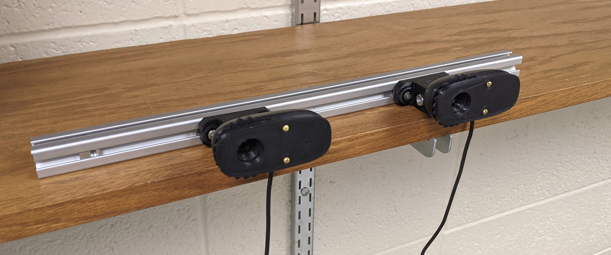

# 3DVision
A simple stereo vision application.
All code available here: https://github.com/contagon/3DVision

# Idea	generation
The idea we chose to implement was a super-powered super-efficient ball-tracker, like an upgrade of HW4. Our goal was to track the trajectory of a ball traveling through the air and use the covariance to calculate a search area for the next step, improving tracking efficiency (small region to search for ball). To do this, we used two webcameras screwed to a rail of 80/20. We calibrated those cameras using the same method as used in HW4. Using the calibration parameters, we then found the 3D pose of the ball. We were then able to use a Kalman filter to improve the trajectory estimates and get the covariance of the trajectory of the ball. We then plotted the calculated position, next 5 timestep predictions along with their covariance rings, onto one of the stereo images. 

 

# Challenges
Some of the challenges we faced with this project had to do with calibration and setup of the cameras. We found that putting the cameras close together (less than 3 inches apart) we were not able to reliably calculate the z distance of the ball from the cameras. We also found that calibrating the cameras in a small room and then throwing the ball within 5 feet of the camera made it difficult to accurately follow the ball. And finally, we also had a hard time getting a useful T matrix from our stereo calibration function. Eventually we found that occasionally our code would reverse the order of the lists of corners used for calibration. 

# Solutions
To fix our calibration and setup issues we simply made sure that the cameras we were using were about 6 inches apart and calibrated the cameras in a larger room. We also made sure to keep the ball at least 6 feet away from the cameras. This allowed us to consistently track the ball and return more accurate z distances. To solve the challenge we had with obtaining a T matrix from the stereo calibration function, we had to resolve the issue with our corner lists. Once that issue was amended, we were able to calibrate and calculate 3D pose smoothly. 

# Video Link
Here is a link to a video showing our working code. 

https://youtu.be/7jo-jmPVrMU
